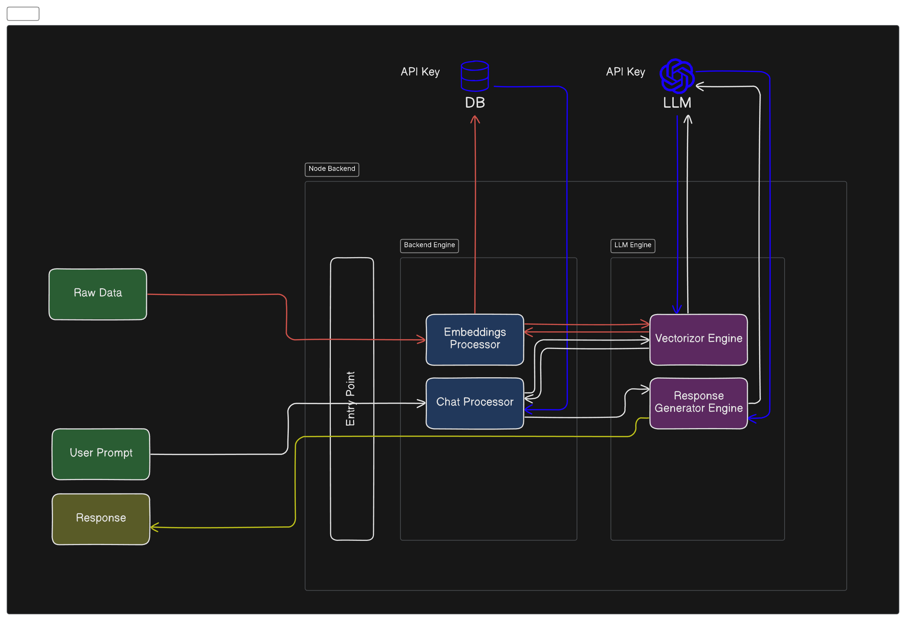

# IPC - BNS LLM Engine

## Description
The introduction of Bharathiya Niyam Samhita (BNS) has been a setback for Indian lawyers, who were already familiar with the current Indian Penal Code(IPC) system. This modified LLM engine is intended to solve this issue. The software can help you find BMS codes for certain IPC sections and answer questions about IPC and BNS.



## Installation
1. Clone the repository:
```bash
git clone git@github.com:bugman-dev/Ipc-bns-BE.git
```
2. Navigate to the project directory:
```bash
cd ipc-bnc-be
```
3. Install dependencies:
```bash
npm install
```

## Usage
### Starting the server
To start the Express server, run the following command:
```bash
npm start
```
By default, the server will run on port 5000. You can specify a different port using the PORT environment variable:
```
PORT=5000
```

### API Endpoints
1. `api/v1/chat`

   - Method: POST
   - Description: Receives user prompt and sends back the processed response.
   - Request Parameters: 
       - `token`: auth token
   - Request Body:
       - `prompt`: User's prompt string
   - Response:
       - Status: 200 OK
       - Body:
       ```json
       {
           "message":"*Processed Response*"
       }
       ```
2. `api/v1/embeddings`
    - Method: GET
   - Description: Retrives all vector data
   - Request Parameters: 
       - `token`: Auth token
   - Request Body: None
   - Response:
       - Status: 200 OK
       - Body:
       ```json
       {
           "data":{}
       }
       ```
3. `api/v1/embeddings`
    - Method: POST
   - Description: Append data to existing records
   - Request Parameters: 
       - `token`: Auth token
   - Request Body: None
       - `data`: "-User's data-"
       - `format`: "-data format (eg: txt, pdf)-"
   - Response:
       - Status: 200 OK
       - Body:
       ```json
       {
           "message":"Success"
       }
       ```
4. `api/v1/embeddings`
    - Method: PUT
   - Description: Completely replace the existing records
   - Request Parameters: 
       - `token`: Auth token
   - Request Body: None
       - `data`: "-User's data-"
       - `format`: "-data format (eg: txt, pdf)-"
   - Response:
       - Status: 200 OK
       - Body:
       ```json
       {
           "message":"Success"
       }
       ```


## Configuration
 * PORT: The port number on which the server will run. Default is 5000.
 * API_ROUTE_VERSION: The api version number (eg: v1, v2)

## Development
Start the live reload server (nodemon) with the command:
```bash
npm run devStart
```

## License
This project is licensed under the GPL-3.0 license. See the [LICENSE](LICENSE) file for details.